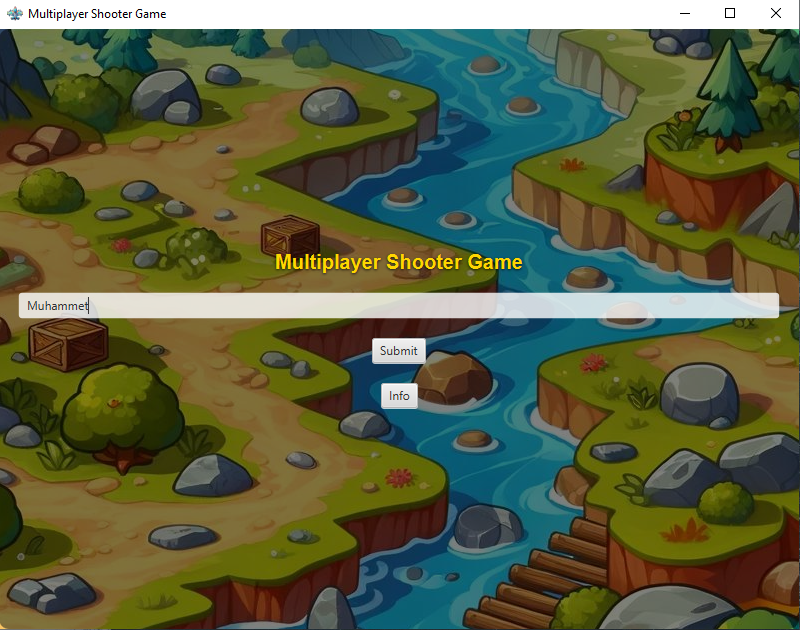

# Multiplayer-Scrolling-Shooter-Game
## Screenshots




*Figure 2: The peaceful habitat where humans can live comfortably.*


*Figure 3: The area where plants and animals have evolved to be larger.*


*Figure 4: The wild zone with fierce plants and animals.*

## Character Design

Our main character is a young, cheerful adventurer with a passion for exploring the forest's depths. Inspired by Indiana Jones, the character sports a big hat, curly hair, and large eyes, giving a charming and animated look.


## Zones

1. **Zone 1: The Peaceful Habitat**
   - A calm and serene area where humans can reside.
   - Features soft, vibrant colors and friendly creatures.

2. **Zone 2: The Evolved Region**
   - Home to larger plants and animals adapted to tougher conditions.
   - Displays a balance between beauty and challenges.

3. **Zone 3: The Wild Frontier**
   - A more dangerous area with fierce flora and fauna.
   - Showcases darker tones and more intense gameplay elements.

## Installation

To install and play Magical Forest Adventure, follow these steps:

1. Clone the repository:
   ```bash
   git clone https://github.com/yourusername/magical-forest-adventure.git
   cd magical-forest-adventure
