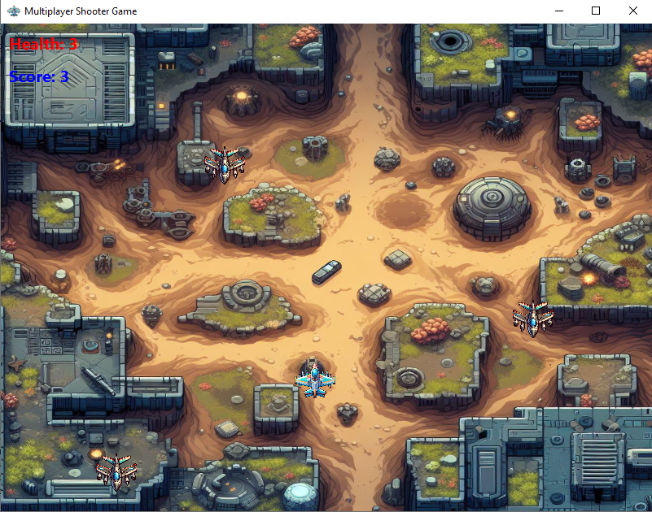
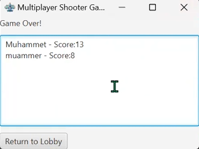

# Multiplayer-Scrolling-Shooter-Game
Game Objective:
In this 3-player 2D arcade game, your goal is to gather in the lobby and fight against enemy ships to score the highest points and achieve victory. Skillfully navigate your ship using keyboard controls, defeat enemies, and climb to the top of the leaderboard!

## Protocol

For detailed information about the game's protocol, please refer to the [Protocol Document (PDF)](Multiplayer-Scrolling-Shooter-Game/protokol.pdf).
## Screenshots

  
*Figure 1: Main menu*

  
*Figure 2: Game information screen*

  
*Figure 3: The screen where players can chat*

  
*Figure 4: Lobby options screen*

  
*Figure 5: The screen that shows available lobbies to players*

  
*Figure 6: The screen that shows game play*

  
*Figure 7: After game finished all calculated points of players shown on the screen*

---
